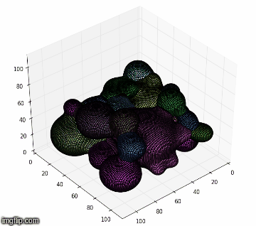

## Phase Field Modelling of nanoparticle sintering
### Introduction
My project involved simulating, visualizing and obtaining parameters used to study nanoparticle sintering using the phase field model.
Sintering is a process of compacting two or more particle powder into single solid at high temperatures, but below the particles’ melting points. This process is used in powder metallurgy to produce high strength and durable materials. To gain understand into how this process takes place in a nanoscale, a phase field modeling approach is used to study the evolution of the microstructures during sintering. Phase field is a set of values of a single variable called order parameter that represent the entire state of the microstructure during sintering[1]. Phase field has proven to be a good model in  modelling sintering because it enables the computational simulation of microstructure evolution without making restrictive assumptions. This feature of the phase field model  makes it an attractive approach to study nanoscale sintering. Computational simulation of nanoscale sintering is presented.

#### Goal
* The **motivation** of this project is to understand the temporal evolution of nanoscale sintering.
* The project **objective** is to successfully perform a 3D simulation and visualization of nanoscale particle sintering using the Phase Field Model.

#### Approach

**Mass Transport Phenomena**
* Grain boundary diffusion
* Surface diffusion
* Volume diffusion

**Methods**
* Phase field model
* Finite difference method

### Result

### Summary
**Accomplishments**
1. Temporal growth of nanoparticle sintering was successfully simulated yielding insights into how particle microstructures evolve during sintering.
2. Most important observation is change in density of individual particles as it sinters while the overall density of the system remains relatively constant as it evolves.

**Acknowledgement**

* Institute for Computational Engineering and Sciences
* Department of Mechanical Engineering
* Dr M. Cullinan
* Georgina Obehi Dibua

### References
[1] Qin, R. S., and H. K. Bhadeshia. "Phase Field Method." Review. n.d.: n. pag. Web. 20 May 2017.

# Code Blocks
#### Simulation & Parameter Search
The simulation program was written by **Georgina Obehi Dibua** in C++. I added some routines to make it work for the purpose of parameter value search. The following table has information about the added routines.

Modifier | Method and Description
--- | --- 
**double** | **inRange**(double low, double high, double seed) `Returns a random number between low and high inclusive`
**void** | **resetParams**()  `Sets parameters' values to default`
**void** | **resetRho**(double* rho,double* newrho, double** eta, int Size) `Sets the density and order parameter values`
**void** | **reassign**(constants* cons, int count, ...) `Sets parameter values to new values`
**bool** | **modify**(const double* sumrho, double* param, double* lowerbound, double* upperbound, const double* maximum, double* t, const int master = 0) `Searches for the maximum parameter value`

#### Visualization
Visualization involved reading the data and plotting it. It was written in Python using Matplotlib(Could have used VTK). The following table has information about the functions.

Modifier |Method and Description
--- | ---
def | **getnumzeros**(vector) `Returns the number of zeroes in the vector`
def | **readRow**(filename) `Reads a single line`
def | **getProduct**(row) `Returns an array of the products of first element and the rest of the elements in row`
def | **parseData**(filename) `Return a tuple of a m by n matrix of data from a text file and number of lines read`
def | **unpack**(matrix) `Unpacks the matrix so that each column represent a single particle. Returns the new matrix`
def | **genColor**(n = 1, manager = None) `Generates n hexadecimal color codes.`
def | **readBinary**(fname,fmt,bsize) `Reads data from a data file.` 
def | **getcoords**(data, xsize, ysize, zsize) `Generates the x,y,z coordinate for data`
def | **plot**(coords, fig, ax, start = 0, count = 10,fcolor = None,  multijob = (False,"filename")) `Plots the coords`
def | **readsingle**(file, offset = 0, ndata = 44, dtype='d') `Reads ndata  of type dtype from file using offset as the byte offset to control read location.`
def | **process**(rho, eta) `Returns the element by element  product of two vectors.`
def | **writable**(filename, writtable) `Writes writtable data to file with name filename.`
def | **readable**(filename) `Reads data from file with name filename`
def | **multijob**(fname) `Multiple process job`
def | **buildCmd**(args) `Builds the command`
